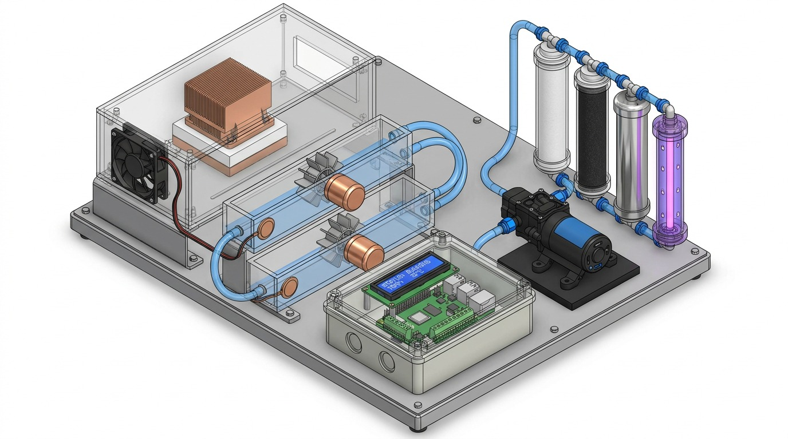

# Eco-Sonic CAD Model

## Prototype CAD Visualization

The following CAD visualization represents the proposed physical architecture of the Eco-Sonic prototype.

## Major Components Represented

The CAD visualization includes:

- Data-center thermal simulation enclosure
- Heat sink and cooling fan assembly
- Water circulation tubing
- Hydraulic pump
- Water-wheel energy harvesting section
- Generator assembly
- Piezoelectric energy harvesting section
- Multi-stage water filtration
- UV-C water treatment chamber
- ESP32-based monitoring and control enclosure
- Water storage and circulation components

## Purpose

The CAD model was developed to visualize the physical arrangement and integration of the major Eco-Sonic subsystems before prototype assembly.

It is used for:

- Prototype layout planning
- Component placement
- Hydraulic routing
- Electrical enclosure placement
- Demonstration and presentation
- Assembly planning
