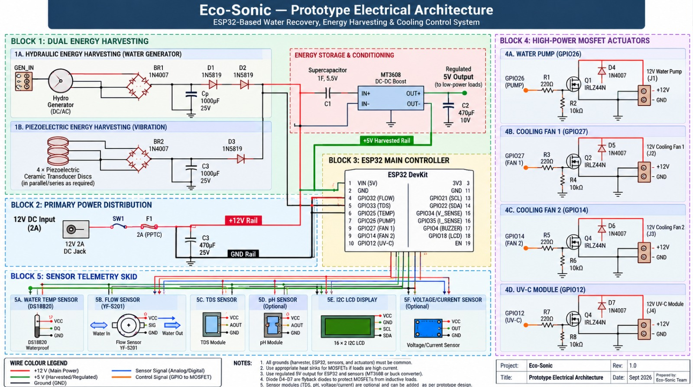

# Eco-Sonic Circuit Diagrams

## Prototype Electrical Architecture

The following schematic presents the proposed electrical architecture
of the Eco-Sonic prototype, including the ESP32 controller, energy
harvesting subsystems, power distribution, sensor telemetry, and
MOSFET-controlled actuators.

### System Blocks

The circuit is organized into five major blocks:

1. **Dual Energy Harvesting**
   - Hydraulic/water-wheel generator
   - Piezoelectric vibration harvesting
   - Rectification
   - Energy storage and conditioning

2. **Primary Power Distribution**
   - 12 V DC input
   - Fuse protection
   - 12 V rail
   - Regulated harvested-energy rail
   - Common ground

3. **ESP32 Main Controller**
   - Sensor acquisition
   - System monitoring
   - Actuator control
   - Display interface

4. **MOSFET Actuators**
   - Water pump
   - Cooling fans
   - UV-C module

5. **Sensor Telemetry**
   - DS18B20 temperature sensor
   - Flow sensor
   - TDS sensor
   - pH sensor
   - I2C LCD
   - Optional voltage/current sensing

## Important Note

This schematic represents the prototype electrical architecture.
Component values, GPIO assignments, power ratings, and wiring should
be verified against the physically assembled prototype before the
design is considered electrically validated.

## Related Documentation

- [Prototype README](../README.md)
- [Bill of Materials](../bill-of-materials.md)
- [Assembly Guide](../assembly-guide.md)
